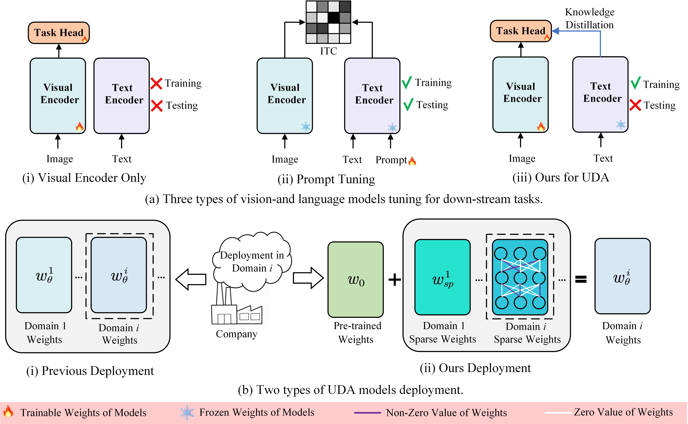

## Unsupervised Domain Adaption Harnessing Vision-Language Pre-training

**by Wenlve Zhou and Zhiheng Zhou**

**[[TCSVT 2024 Paper]](https://ieeexplore.ieee.org/document/10505301)**
**[[pdf]](resources/manuscript.pdf)**
**[[论文解读]](https://zhuanlan.zhihu.com/p/710308374)**


## Overview

This paper addresses two vital challenges in Unsupervised Domain Adaptation (UDA) with a focus on harnessing the power of Vision-Language Pre-training (VLP) models. 

Firstly, UDA has primarily relied on ImageNet pre-trained models. However, the potential of VLP models in UDA remains largely unexplored. The rich representation of VLP models holds significant promise for enhancing UDA tasks. To address this, we propose a novel method called Cross-Modal Knowledge Distillation (CMKD), leveraging VLP models as teacher models to guide the learning process in the target domain, resulting in state-of-the-art performance. 

Secondly, current UDA paradigms involve training separate models for each task, leading to significant storage overhead and impractical model deployment as the number of transfer tasks grows. To overcome this challenge, we introduce Residual Sparse Training (RST) exploiting the benefits conferred by VLP's extensive pre-training, a technique that requires minimal adjustment (approximately 0.1%~0.5) of VLP model parameters to achieve performance comparable to fine-tuning. 

Combining CMKD and RST, we present a comprehensive solution that effectively leverages VLP models for UDA tasks while reducing storage overhead for model deployment. Furthermore, CMKD can serve as a baseline in conjunction with other methods like FixMatch, enhancing the performance of UDA.



## Training

You can employ various networks to train on different datasets according to your objectives. 

For instance, when utilizing ResNet50 for training Art --> Clipart on the office-home dataset, you may execute the following command:

```shell
python main.py --config configs/office_home.yaml --data_dir data/office_home --src_domain Art --tgt_domain Clipart --model_name RN50 --lr 3e-7 --multiple_lr_classifier 10000
```
When employing residual sparse training, simply include "--rst" in your command:
```shell
python main.py --rst --config configs/office_home.yaml --data_dir data/office_home --src_domain Art --tgt_domain Clipart --model_name RN50 --lr 3e-7 --multiple_lr_classifier 10000
```
When implementing FixMatch training, just add "--fixmatch":
```shell
python main.py --fixmatch --config configs/office_home.yaml --data_dir data/office_home --src_domain Art --tgt_domain Clipart --model_name RN50 --lr 3e-7 --multiple_lr_classifier 10000
```

## Testing

You can use the checkpoints saved from the training phase for testing, for example:

```shell
python test.py --data_dir data/office_home --src_domain Art --tgt_domain Clipart --model_name RN50
```
When employing residual sparse training, simply include "--rst" in your command:
```shell
python test.py --rst --data_dir data/office_home --src_domain Art --tgt_domain Clipart --model_name RN50
```
